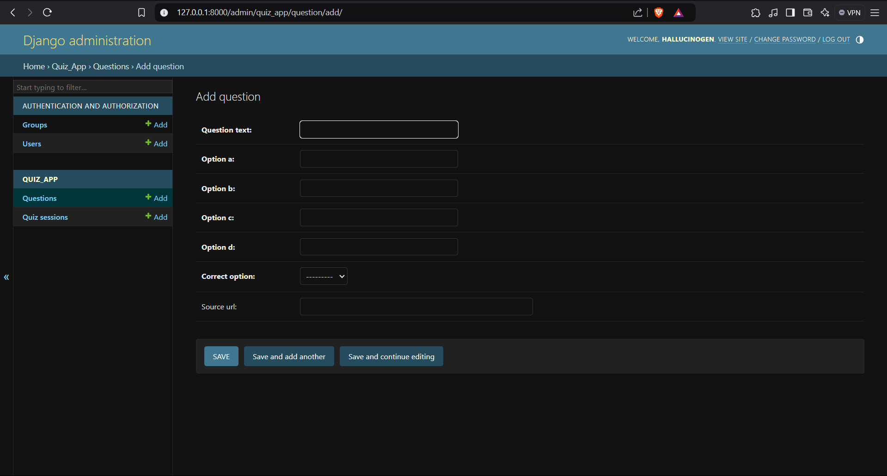
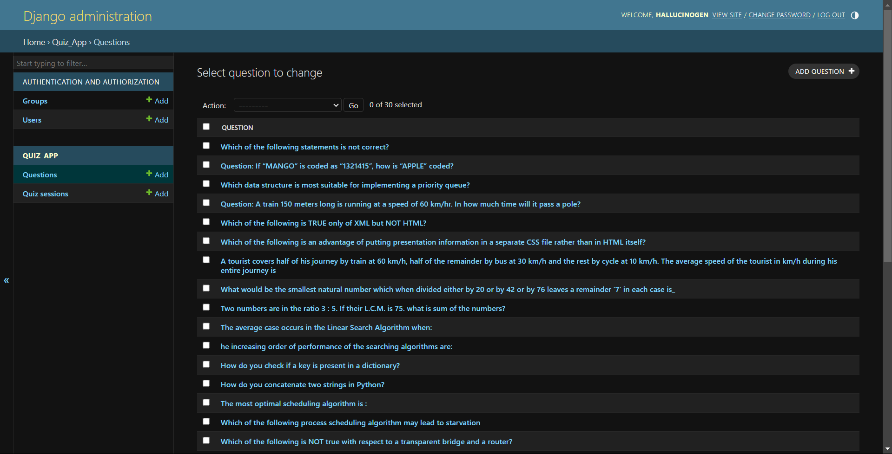

# Django Quiz App

This is a simple Django-based quiz application that fulfills the following functionalities:

1. **Start a New Quiz Session:**  
   The user can begin a new quiz session, which tracks their progress and results.

2. **Get a Random Multiple-Choice Question from the Database:**  
   The app randomly selects a question from the database. Questions are stored in the database as `Question` model instances.

3. **Submit an Answer:**  
   The user can submit their answer, and the app updates their quiz session statistics (total answered, correct, incorrect).

4. **View Quiz Results and Stats:**  
   After completing the quiz or reaching the chosen question limit, the user can view total questions answered, correct/incorrect count, accuracy, and time taken.  
   Additionally, the results page can show where questions came from (if `source_url` is provided), allowing the user to learn more about the topic.

## Additional Features

- **Non-Repetitive Questions Until All Seen:**  
  During a session, no question will repeat until all questions have been shown at least once. After cycling through all questions, repetition is allowed.

- **User-Selectable Number of Questions:**  
  The user can choose how many questions to answer in a session (1, 5, 10, 15, 30).

- **Enhanced UI/UX Dashboard:**  
  The result page acts as a dashboard, showing accuracy and time taken. If questions have a `source_url`, the user can easily access further learning materials.
  
## Django Admin Panel

Below are examples of how the Django admin panel looks. From here, you can add or edit questions.

**Add Question Page:**


**Edit Question Page:**



## Assumptions

- Only one user is required (no multi-user handling).
- Questions are stored in the database and can be added either via the Django admin panel or through a management command.
- No separate UI for question creation is required by the assignment (admin panel usage is acceptable).

## Project Structure
quiz_project/
├─ quiz_project/
│  ├─ __init__.py
│  ├─ asgi.py
│  ├─ settings.py
│  ├─ urls.py
│  └─ wsgi.py
├─ quiz_app/
│  ├─ __init__.py
│  ├─ admin.py
│  ├─ apps.py
│  ├─ migrations/
│  │  └─ __init__.py
│  ├─ models.py
│  ├─ templates/
│  │  └─ quiz_app/
│  │     ├─ dashboard.html
│  │     ├─ home.html
│  │     ├─ question.html
│  │     └─ result.html
│  ├─ urls.py
│  └─ views.py
├─ images/
│  ├─ Screenshot 2024-12-18 152642.png
│  └─ Screenshot 2024-12-18 152650.png
├─ manage.py
└─ requirements.txt


## Setup Instructions

**Install Requirements:**
```bash
pip install -r requirements.txt

Migrate the Database:
python manage.py makemigrations
python manage.py migrate

Create Superuser (Optional):
python manage.py createsuperuser

Run the Server:
python manage.py runserver

Visit http://127.0.0.1:8000/ to start the quiz.


